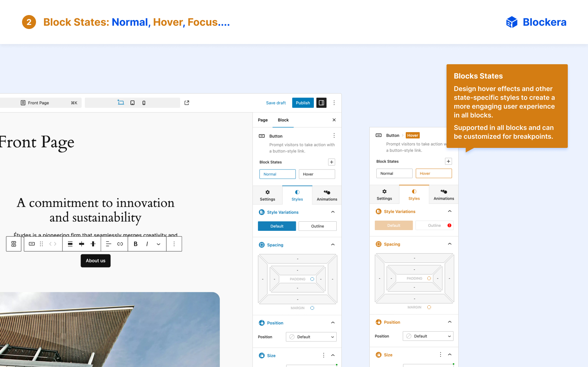

<h1 align="center">Blockera Site Builder</h1>
<h3 align="center">The Advanced Mode for Block Editor</h3>

	Transform WordPress Block Editor into a Powerful Page Builder with Blockera

	<a href="https://blockera.ai">🌠Blockera Website</a> · <a href="https://wordpress.org/plugins/blockera/"> Download Plugin</a>

 
 
 
 
 

<h2>Tired of Gutenberg's limitations?</h2>

**🧐 Imagine this:** All the familiarity of Gutenberg, same core blocks but **supercharged** with **advanced options** and **responsive controls**. 

That's **Blockera**, Welcome to the Block Era! 😎

Blockera transforms block editor (Gutenberg) into a powerful page builder, by enhancing all core blocks. It's the ADVANCED MODE for Gutenberg.

This unique approach ensures a seamless transition and empowers you to create stunning, responsive websites with advanced design capabilities and animations.

<h3>Who Is Blockera For? 🎯</h3>

Blockera is for anyone that tired of Gutenberg's limitations and weak performance of other page builders. 

Install Blockera today and unlock the true potential of Gutenberg for creating professional and blazing fast websites!

<h3>7️⃣ Key Missing Features of Gutenberg that Blockera Adds 🏆</h3>

- 1️⃣ **Responsive Design Controls**: Allows you to customize **all style settings** for **all screen sizes** easily, ensuring your site looks perfect on all devices. This feature is not just advanced but also unique to Blockera.

- 2️⃣ **Advanced Style Customization Options**: Blockera offers all CSS style customization options for all blocks, making it easy to achieve any design you can imagine. With an intuitive UX, even complex CSS adjustments are a breeze.

- 3️⃣ **Supporting All Core Blocks**1: Blockera doesn’t overwhelm you with new blocks. Instead, it supercharges all existing core blocks, adding the advanced features you need to take your website to the next level. Works with all block themes, classic themes and Gutenberg-enabled websites.

- 4️⃣ **Block States**: Design **hover effects** and other state-specific styles to create a more engaging user experience in all blocks. Blockera supports all HTML states for unparalleled flexibility in all core blocks2.

- 5️⃣ **Custom CSS For Blocks**3: For those who want to push the boundaries even further, Blockera allows you to add custom CSS codes per block. This feature provides expert developers with the freedom to implement highly specific customizations.

- 6️⃣ **Inner Blocks Customization**: This unique feature lets you customize the design of all nested and child blocks from the parent block without having to change them one by one. In upcoming updates, you will be able to attach these customizations to block style variations.

- 7️⃣ **Supporting All WooCommerce Blocks**4: Blockera supports WooCommerce blocks as same as core blocks with advanced options, such as block states, custom CSS, and more.

All of these features are available in Blockera already. So what's the future of Blockera?

<h3>Upcoming Features of Blockera 🔥🔥🔥</h3>

Currently we are working on the following features to add in Blockera:

- **Blocks Style Variation Manager**: We are working on blocks style variation manager that lets you to create new style variation for blocks or update current styles form block editor.

- **Variable Support for All Features**: Currently, Blockera supports variable support for `colors`, `font size` and `spacing` but we are working on to support variable support for all other features like `box shadow`, `border`, `transforms`, `transitions` and all other features beside that we will add an option to create custom variables.

- **Pattern Library**: We will add a new pattern library for Blockera that includes many pre-made patterns and also you can create your own.

- **Icon Support for Blocks and Icon Library**: We will add an option to add icons for button, menu and many other blocks and an icon library to select icons from or upload your own icons.

- **Animation Support for Blocks**: We will add options to add animation for all blocks with features to create advanced and fast animations easily.

- **Block Conditions**: We will add option to add visibility conditions for all blocks with features to create advanced conditions to show or hide blocks.

- **AI Integration**: We will add AI integration to block editor for creating content or designing websites. We are working on it.

## Installation 😍

1. Download Blockera from the [WordPress plugin directory](https://wordpress.org/plugins/blockera/).
2. Install and Activate it 🎉

## Support 👋

Need help? This is a developer's portal for Blockera and should not be used for general support and queries. Please visit the [Blockera community](https://community.blockera.ai/) for assistance.

## Change log and Releases 📝
Complete list of updates and releases is available in [changelog](https://community.blockera.ai/changelog-9l8hbrv0).

## Contributors 😎
 
 

Blockera is built by [contributors and volunteers](./.github/CONTRIBUTING.md) around the globe.

## Screenshots 🌇

